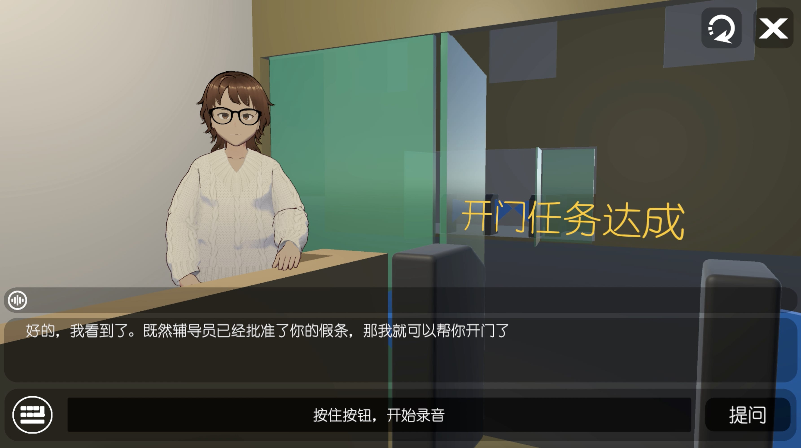

# 大模型角色扮演游戏：《挑战十句话说服宿管阿姨开门》

## 特别说明

本项目仅用于非盈利的娱乐、科普、科研、辅助教学。

由生成式AI输出的回答结果，可能有待进一步优化，不代表任何人的观点，任何后果与开发团队无关。

## 概述

视频介绍：https://www.bilibili.com/video/BV1F94y1j7AP

【游戏安装包下载】公众号 人工智能小技巧 回复 宿管阿姨

【加入大模型游戏交流群】公众号 人工智能小技巧 回复 宿管阿姨

## 原理

## 开发团队

- 刘浪

Github：https://github.com/Liulang-whynotme

- 张子豪（同济子豪兄）

长期从事人工智能、深度学习、计算机视觉的科普教育工作。微软人工智能最有价值专家（MVP）、华为云人工智能HCDE云享专家、中国图象图形学学会-科普与教育工作委员会委员。

代表作：精读AI论文、斯坦福CS231N计算机视觉中文精讲、CS224W图神经网络中文精讲、“两天搞定图像分类、目标检测、图像分割、关键点检测毕业设计”、可解释机器学习公开课。

B站“同济子豪兄”主页：https://space.bilibili.com/1900783

Github：https://github.com/TommyZihao

微信号：tongjizihaoxiong

- 杨耀东（东哥）
  
资深软件工程师，擅长大数据、前后端、微信小程序、安卓APP、Web网站开发。

Github：https://github.com/maxoyed

## 【寻找游戏大模王】活动

百度智能云发起了【寻找游戏大模王】活动，用千帆大模型探索游戏的N种全新玩法，还有巨额奖金等你瓜分~

报名链接：https://cloud.baidu.com/survey_summit/qrl.html?track=C452658

百度智能云千帆大模型平台：https://cloud.baidu.com/product/wenxinworkshop

百度智能云千帆社区：https://cloud.baidu.com/qianfandev

创意讨论、大佬组队：B站私信“同济子豪兄”

## 合作

技术咨询、业务合作：B站私信“同济子豪兄”

行业大模型、微信小程序、网站定制开发：公众号 人工智能小技巧 回复 定制开发

## 参考资料

百度智能云官网：https://cloud.baidu.com

百度智能云千帆大模型平台：https://cloud.baidu.com/product/wenxinworkshop

百度智能云千帆社区：https://cloud.baidu.com/qianfandev

百度智能云千帆大模型平台API文档：https://cloud.baidu.com/doc/WENXINWORKSHOP/s/clntwmv7t

百度智能云千帆大模型平台API在线调试平台：https://console.bce.baidu.com/tools/?u=bce-head#/api?product=AI&project=%E5%8D%83%E5%B8%86%E5%A4%A7%E6%A8%A1%E5%9E%8B%E5%B9%B3%E5%8F%B0&parent=ERNIE-Bot-4%EF%BC%88%E9%82%80%E6%B5%8B%EF%BC%89&api=rpc/2.0/ai_custom/v1/wenxinworkshop/chat/completions_pro&method=post

AI编程工具Comate：https://comate.baidu.com

文心一言：https://yiyan.baidu.com

